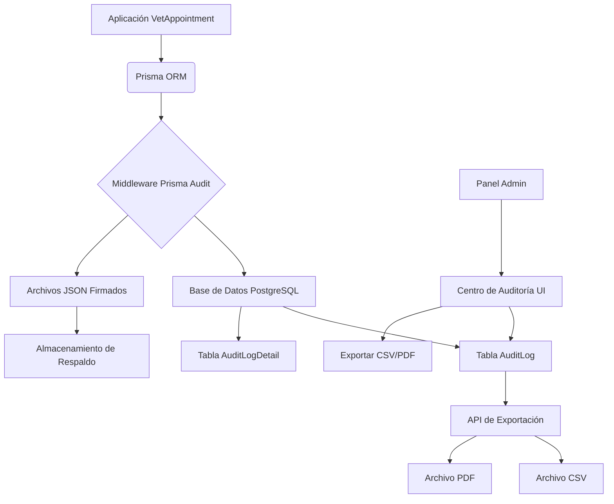

# Sistema de Logging y Auditoría Inmutable para VetAppoint

## Historial de Versiones

| Version | Fecha | Autor | Descripción |
|---------|-------|-------|-------------|
| 1.0 | 2026-06-16 | Sistema | Documento inicial de planificación |
| 1.1 | 2026-06-16 | Sistema | Agregada sección de Vista de Administrador (Centro de Auditoría) |

---

## 1. Propósito y Alcance

Este documento define la arquitectura, implementación y operación del Sistema de Logging y Auditoría para VetAppoint, diseñado para garantizar la trazabilidad completa, seguridad e inmutabilidad de los registros de datos sensibles de pacientes veterinarios.

### 1.1 Objetivos del Sistema

- **Trazabilidad Completa:** Registrar quién, cuándo, cómo y qué cambió en los datos sensibles.
- **Inmutabilidad:** Garantizar que los logs de auditoría no puedan ser alterados o eliminados.
- **Cumplimiento Regulatorio:** Facilitar la presentación de informes ante entidades de control veterinarias.
- **Seguridad:** Firmar digitalmente todos los registros para autenticar su integridad.

### 1.2 Alcance de las Entidades Auditadas

Todas las operaciones de escritura (`create`, `update`, `delete`) sobre los siguientes módulos/entidades serán auditadas obligatoriamente:

- `User` / `Client`
- `Pet`
- `Appointment`
- `MedicalRecord`
- `Vaccination`
- `Deworming`
- `SurgicalHistory`
- `ChronicCondition`
- `Category`

---

## 2. Requisitos Técnicos y de Regulación

### 2.1 Inmutabilidad y Firma Digital

- **Mecanismo:** Encadenamiento de Hashes SHA-256.
- **Firma:** HMAC-SHA256 utilizando una `AUDIT_SECRET_KEY`.
- **Almacenamiento:** Base de datos PostgreSQL con respaldo en archivos JSON firmados.

### 2.2 Granularidad del Rastreo (Cada Log de Auditoría)

| Campo | Descripción |
|-------|-------------|
| `userId` | ID del usuario que ejecutó la acción |
| `userFullName` | Nombre completo del usuario |
| `userEmail` | Email del usuario |
| `action` | Método: `CREATION`, `READ`, `UPDATE`, `DELETE` |
| `module` | Nombre del módulo ejecutado |
| `entityType` | Tabla o entidad afectada |
| `entityId` | ID del registro específico modificado |
| `timestamp` | Fecha y hora exacta de la operación (ISO 8601) |
| `ipAddress` | Dirección IP del usuario originador |
| `fieldChanges` | Array de objetos `{ fieldName, oldValue, newValue }` |
| `previousHash` | Hash SHA-256 del log inmediatamente anterior |
| `signature` | Firma digital del log actual |

### 2.3 Retención de Datos (TTL)

- **Activo:** Los logs permanecerán en la tabla principal `AuditLog` durante un período de 2 años.
- **Archivado:** Pasados los 2 años, los logs deberán ser archivados (movidos a una tabla de historial o exportados y comprimidos).

### 2.4 Formatos de Exportación

Se implementarán endpoints de API para la generación de reportes en los siguientes formatos:

- **CSV:** Para importación en hojas de cálculo y análisis externo.
- **PDF:** Para presentación formal ante entidades regulatorias.

---

## 3. Arquitectura del Sistema

### 3.1 Componentes Principales



### 3.2 Flujo de Datos (Operación de Escritura)

1. El usuario realiza una acción (ej: modificar historial médico de una mascota).
2. El Middleware de Prisma intercepta la operación de `create`, `update` o `delete`.
3. Se captura el estado actual de los datos (para comparación en `update`).
4. La transacción Prisma ejecuta la query original.
5. Se captura el resultado de la operación.
6. El sistema de auditoría compara los datos (si es `update`) para determinar los `fieldChanges`.
7. Se genera el hash encadenado y la firma digital.
8. Se guarda el registro maestro en `AuditLog` y los detalles en `AuditLogDetail` dentro de la misma transacción.
9. Se genera o actualiza el archivo JSON firmado de respaldo (proceso asíncrono o en una cola).
10. Se retorna el control a la aplicación.

---

## 4. Modelos de Datos (Prisma Schema)

### 4.1 Tabla `AuditLog`

```prisma
model AuditLog {
  id           String    @id @default(uuid())
  userId       String
  userFullName String    // Nombre completo del usuario (denormalizado para auditoría)
  userEmail    String    // Email del usuario (denormalizado para auditoría)
  action       String    // CREATE, READ, UPDATE, DELETE (o CREATION, EDITION, DELETION)
  module       String    // Nombre del módulo/entidad
  entityId     String    // ID del registro afectado
  entityType   String    // Nombre de la tabla/modelo
  timestamp    DateTime  @default(now())
  ipAddress    String?
  previousHash String    // Hash del registro anterior para inmutabilidad
  signature    String    // Firma digital (HMAC-SHA256)

  // Relaciones
  user         User      @relation(fields: [userId], references: [id])
  details      AuditLogDetail[]

  // Indices
  @@index([userId])
  @@index([entityId])
  @@index([action])
  @@index([module])
  @@index([timestamp])
}
```

### 4.2 Tabla `AuditLogDetail`

```prisma
model AuditLogDetail {
  id         String   @id @default(uuid())
  fieldName  String   // Nombre del campo modificado
  oldValue   String?  // Valor anterior (Texto largo para campos JSON)
  newValue   String?  // Valor nuevo (Texto para campos JSON)

  // Relaciones
  auditLogId String
  auditLog   AuditLog @relation(fields: [auditLogId], references: [id], onDelete: Cascade)

  // Indices
  @@index([auditLogId])
}
```

---

## 5. Implementación Técnica

### 5.1 Servicio de Firma Digital y Cadena de Hashes (`src/services/audit-signature.ts`)

Implementación de las utilidades para asegurar la inmutabilidad:

- `calculateHash(data: object, previousHash: string): string`: Calcula el hash SHA-256 del contenido del log + `previousHash`.
- `generateSignature(data: object): string`: Crea la firma HMAC-SHA256 usando la `AUDIT_SECRET_KEY`.
- `verifySignature(data: object, signature: string): boolean`: Valida la integridad de un log comparando la firma.

### 5.2 Middleware Prisma de Auditoría (`src/lib/audit-middleware.ts`)

- Se integrará en el archivo `src/lib/prisma.ts`.
- Debe ejecutarse **después** de la operación principal pero dentro de la misma transacción.
- Para `update`: debe realizar una query previa (`findFirst` o `findUnique`) para obtener los valores antiguos y poder identificar los campos cambiados y sus valores.
- Debe manejar el contexto del usuario (rescatado de la sesión o headers de la request).

### 5.3 Configuración de Logging Operacional (`src/lib/logger.ts`)

- **Desarrollo:** `pino` con `pino-pretty` para output en consola humano-legible.
- **Producción:** `winston` con formato JSON y transporte `DailyRotateFile` para persistir los logs de la API en archivos rotativos diarios.

---

## 6. Vista de Administrador (Centro de Auditoría)

### 6.1 Descripción General

Sección exclusiva en el panel de administración para la visualización y gestión de los logs de auditoría. Permite a los administradores verificar la integridad de los registros y exportar datos para cumplimiento regulatorio.

### 6.2 Características Principales

| Función | Descripción |
|---------|-------------|
| **Filtros Dinámicos** | Fecha (rango), Usuario, Módulo (entidad), Acción (CREATE, UPDATE, DELETE) |
| **Tabla de Resultados** | Fecha exacta, Usuario (Nombre + Email), Acción (con color), Módulo, Entidad afectada |
| **Verificación Visual** | Indicador de integridad del hash (✅ Íntegro / ❌ Corrupto) |
| **Exportación** | Botones para descargar en **CSV** y **PDF** |
| **Paginación** | Manejo de grandes volúmenes de datos |

### 6.3 Componentes UI Propuestos

| Componente | Propósito |
|------------|-----------|
| `AuditLogsPage` | Página principal del centro de auditoría (`src/app/(admin)/audit-logs/page.tsx`) |
| `AuditLogTable` | Tabla principal con paginación y columnas de datos |
| `AuditLogFilters` | Barra de filtros con inputs de fecha y selects |
| `AuditLogRow` | Fila individual con indicadores de acción e integridad |
| `IntegrityBadge` | Componente visual para el estado de verificación del hash |
| `ExportButtons` | Botones de acción para exportar a CSV y PDF |

### 6.4 Control de Acceso

- **Ruta:** `/admin/audit-logs`
- **Permisos:** Exclusivamente usuarios con rol `ADMIN`
- **Middleware:** Verificación de rol en cada request a los endpoints de auditoría

### 6.5 Mockup de la Interfaz

```
┌─────────────────────────────────────────────────────────── ADMINISTRACIÓN ─┐
│  [Usuarios] [Mascotas] [Citas] [Historial Médico] [Registro de Auditoría]   │
├────────────────────────────────────────────────────────────────────────────┤
│  📋 REGISTRO DE AUDITORÍA                                                     │
│                                                                              │
│  🔍 Filtros:                                                                  │
│  ┌─────────────┐  ┌─────────────┐  ┌───────────────────┐  ┌──────────────┐  │
│  │ Desde:      │  │ Hasta:      │  │ Usuario: [Buscar] │  │ Acción:      │  │
│  │ [16/05/2026]│  │ [16/06/2026]│  │                   │  │ [Todas    ▼] │  │
│  └─────────────┘  └─────────────┘  └───────────────────┘  └──────────────┘  │
│                                                                              │
│  Módulo: [Todos ▼]                                                            │
│  [Aplicar Filtros]  [Limpiar]                                                 │
│                                                                              │
│  Total registros encontrados: 1,245                                          │
│                                                                              │
│  ┌────────────────────┬─────────────────┬──────────┬────────────────┬──────────┬──────────┐ │
│  │ Fecha              │ Usuario         │ Acción   │ Entidad        │ Módulo   │ Integridad│ │
│  ├────────────────────┼─────────────────┼──────────┼────────────────┼──────────┼──────────┤ │
│  │ 16/06/2026 10:30   │ Dr. García      │ Creación │ M-001          │ Historial│ ✅       │ │
│  │ dr.garcia@vet.cl   │                 │ (naranja)│                │ Médico   │          │ │
│  ├────────────────────┼─────────────────┼──────────┼────────────────┼──────────┼──────────┤ │
│  │ 16/06/2026 11:15   │ Admin           │ Edición  │ P-045          │ Mascota  │ ✅       │ │
│  │ admin@vet.cl       │                 │ (azul)   │                │          │          │ │
│  ├────────────────────┼─────────────────┼──────────┼────────────────┼──────────┼──────────┤ │
│  │ 16/06/2026 11:20   │ Recepcionista 1  │ Eliminación│ A-120       │ Cita     │ ✅       │ │
│  │ recep1@vet.cl     │                 │ (rojo)    │                │          │          │ │
│  └────────────────────┴─────────────────┴──────────┴────────────────┴──────────┴──────────┘ │
│                                                                              │
│  [◀ Anterior]  Página 1 de 124  [Siguiente ▶]                                │
│                                                                              │
│  💾 Exportar:  [Descargar CSV]  [Descargar PDF]                              │
└────────────────────────────────────────────────────────────────────────────┘
```

### 6.6 Detalle de Fila Expandible (Opcional)

Al hacer clic en una fila, se puede expandir para mostrar los cambios específicos de campo:

```
│ 16/06/2026 10:30   │ Dr. García  │ ... │ M-001 │ ... │ ✅ │
│                     └─────────────────────────────────────────────────┤
│                     📋 Detalle de Cambios:                               │
│                     ┌──────────────────┬────────────┬───────────────┐   │
│                     │ Campo            │ Valor Anterior│ Valor Nuevo │   │
│                     ├──────────────────┼────────────┼───────────────┤   │
│                     │ diagnosis        │ Gripe      │ Influenza     │   │
│                     │ treatment        │ -          │ Antibióticos  │   │
│                     │ publicNotes      │ -          │ Paciente      │   │
│                     │                  │            │ estable       │   │
│                     └──────────────────┴────────────┴───────────────┘   │
```

### 6.7 Estados de Verificación de Integridad

| Estado | Indicador | Significado |
|--------|-----------|-------------|
| **Válido** | ✅ Verde | El hash y la firma digital son correctos |
| **Inválido** | ❌ Rojo | Los datos fueron alterados o la firma no coincide |
| **Verificando** | ⏳ Gris | Verificación en proceso |

---

## 7. Exportación y Reportes

### 7.1 Endpoints de API

- `GET /api/v1/audit-logs`: Endpoint para listar auditorías en la aplicación (paginado, con filtros).
- `GET /api/v1/audit-logs/export/csv`: Genera un archivo CSV con los filtros aplicados (fecha, usuario, módulo, acción).
- `GET /api/v1/audit-logs/export/pdf`: Genera un archivo PDF formateado para auditoría.
- `GET /api/v1/audit-logs/[id]/verify`: Endpoint para verificar la integridad de un log específico.

### 7.2 Librerías Sugeridas

- **CSV:** `csv-writer` o nativo.
- **PDF:** `jsPDF` y `jspdf-autotable` (ya utilizados en el proyecto para historial médico).

### 7.3 Formato del PDF de Auditoría

El PDF generado para entidades regulatorias deberá incluir:

- **Encabezado:** Logo de VetAppoint + título "Registro de Auditoría"
- **Rango de Fechas:** Período cubierto por el reporte
- **Tabla Principal:** Lista de operaciones con todas las columnas
- **Totales:** Cantidad de operaciones por tipo (creación, edición, eliminación)
- **Pie de Página:** Fecha de generación,hash del reporte

---

## 8. Instalación y Configuración

### 8.1 Dependencias a Instalar

```bash
# Logging operacional
pnpm add pino pino-pretty winston winston-daily-rotate-file

# Utilidades para exportación
pnpm add csv-writer

# Seguridad y Criptografía (nativo de Node.js, no requiere instalación)
```

### 8.2 Variables de Entorno (.env)

```env
# Clave secreta para generar firmas HMAC en los logs de auditoría (alta importancia)
AUDIT_SECRET_KEY="tu-clave-secreta-ultra-segura-de-32-caracteres-min"

# Ruta para el archivo de logs operacionales (opcional, si usas archivos)
LOG_FILE_PATH="./logs"
```

---

## 9. Consideraciones de Seguridad

- **AUDIT_SECRET_KEY:** Debe ser generada con alta entropía (al menos 32 bytes) y nunca debe ser publicada en el repositorio. Se recomienda rotar la clave anualmente, aunque esto implica una estrategia para validar logs firmados con claves antiguas.
- **Protección de Endpoints:** Los endpoints de exportación de logs deben estar restringidos únicamente a usuarios con rol `ADMIN`.
- **Datos Sensibles en Logs:** Se debe garantizar que los logs de auditoría no registren datos de pago ni contraseñas en texto plano.
- **Validación de Integridad:** El sistema debe notificar al admin si se detecta alguna inconsistencia en la cadena de hashes.

---

## 10. Consideraciones de UI/UX

### 10.1 Paleta de Colores para Acciones

| Acción | Color | Justificación |
|--------|-------|---------------|
| **Creación** | Naranja (#F97316) | Indica acción de agregar |
| **Lectura** | Gris (#6B7280) | Indica acción de solo lectura |
| **Edición** | Azul (#3B82F6) | Indica modificación |
| **Eliminación** | Rojo (#EF4444) | Indica eliminación/eliminación potencial |

### 10.2 Responsive Design

- **Desktop:** Tabla completa con todas las columnas visibles.
- **Tablet:** Columnas reducidas, entidad y módulo pueden colapsar.
- **Mobile:** Vista de lista simplificada con acciones colapsables.

### 10.3 Estados de Carga

- Skeleton loader durante la carga de datos.
- Spinner durante la exportación de archivos.
- Toast notifications para éxito/error de operaciones.

---

## 11. Próximos Pasos y Tareas

### Fase 1: Fundación de Datos y Servicios

| # | Tarea | Prioridad | Estado |
|---|-------|-----------|--------|
| 1 | Crear modelos `AuditLog` y `AuditLogDetail` en `prisma/schema.prisma` | Alta | ⏳ Pendiente |
| 2 | Ejecutar `prisma migrate dev` | Alta | ⏳ Pendiente |
| 3 | Desarrollar `src/services/audit-signature.ts` (Hash + HMAC) | Alta | ⏳ Pendiente |

### Fase 2: Captura y Almacenamiento

| # | Tarea | Prioridad | Estado |
|---|-------|-----------|--------|
| 4 | Desarrollar `src/lib/audit-middleware.ts` (captura de auditoría) | Alta | ⏳ Pendiente |
| 5 | Desarrollar `src/lib/logger.ts` (pino/winston) | Media | ⏳ Pendiente |
| 6 | Inyectar middleware en `src/lib/prisma.ts` | Alta | ⏳ Pendiente |
| 7 | Probar captura de logs en operaciones CRUD | Alta | ⏳ Pendiente |

### Fase 3: Interfaz y Reportes (UI)

| # | Tarea | Prioridad | Estado |
|---|-------|-----------|--------|
| 8 | Crear página `src/app/(admin)/audit-logs/page.tsx` | Alta | ⏳ Pendiente |
| 9 | Implementar componente `AuditLogTable` con filtros | Alta | ⏳ Pendiente |
| 10 | Implementar componente `IntegrityBadge` | Media | ⏳ Pendiente |
| 11 | Crear endpoint `GET /api/v1/audit-logs` con paginación | Alta | ⏳ Pendiente |
| 12 | Crear endpoint `GET /api/v1/audit-logs/export/csv` | Media | ⏳ Pendiente |
| 13 | Crear endpoint `GET /api/v1/audit-logs/export/pdf` | Media | ⏳ Pendiente |
| 14 | Crear endpoint `GET /api/v1/audit-logs/[id]/verify` | Media | ⏳ Pendiente |
| 15 | Agregar protección de rol ADMIN a endpoints de auditoría | Alta | ⏳ Pendiente |

### Fase 4: Testing y Validación

| # | Tarea | Prioridad | Estado |
|---|-------|-----------|--------|
| 16 | Implementar tests de integridad y firma digital | Media | ⏳ Pendiente |
| 17 | Testing de extremo a extremo de la UI de auditoría | Media | ⏳ Pendiente |

---

## 12. Anexos

### Glosario

- **HMAC:** Hash-based Message Authentication Code (Código de autenticación de mensajes basado en hash).
- **SHA-256:** Algoritmo de hash seguro de 256 bits.
- **TTL:** Time To Live (Tiempo de vida de los datos antes de ser archivados).
- **Pino:** Logger de Node.js de alto rendimiento.
- **Winston:** Logger configurable y flexible para Node.js.
- **Centro de Auditoría:** Interfaz de usuario para visualizar y gestionar logs de auditoría.
